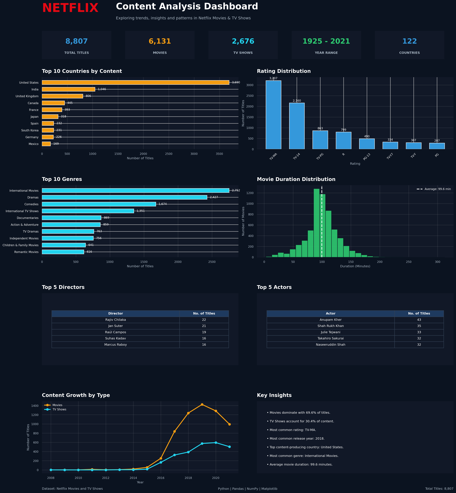

# 🎬 Netflix Data Analysis

## 📌 Project Overview

This project performs Exploratory Data Analysis (EDA) on the Netflix Movies and TV Shows dataset using Python.

The analysis focuses on understanding Netflix content trends, genres, countries, ratings, movie durations, TV show seasons, directors, actors, and content growth over time.

---

## 🎯 Objectives

- Analyze Movies vs TV Shows distribution
- Identify top countries contributing Netflix content
- Analyze popular genres
- Study rating distribution
- Analyze movie duration
- Explore TV show seasons
- Identify top directors and actors
- Analyze content growth over time
- Generate meaningful insights from the dataset

---

## 🛠️ Technologies Used

- Python
- Pandas
- NumPy
- Matplotlib
- Seaborn
- Google Colab

---

## 📊 Dataset

The project uses the **Netflix Movies and TV Shows dataset** containing information such as:

- Title
- Content Type
- Director
- Cast
- Country
- Release Year
- Rating
- Duration
- Genre
- Date Added
- Description

The dataset contains **8,807 titles**.

---

## 📈 Analysis Performed

### 1. Movies vs TV Shows
Comparison of the number of Movies and TV Shows available in the dataset.

### 2. Top 10 Countries
Analysis of countries with the highest number of Netflix titles.

### 3. Top 10 Genres
Identification of the most common genres/categories.

### 4. Rating Distribution
Analysis of content ratings across Netflix titles.

### 5. Movie Duration Distribution
Analysis of movie durations in minutes.

### 6. Top 5 Directors
Identification of directors with the highest number of titles.

### 7. Top 5 Actors
Identification of actors appearing in the highest number of titles.

### 8. Content Growth by Type
Analysis of Movies and TV Shows added to Netflix over the years.

### 9. Key Insights
Summary of important patterns and findings discovered during the analysis.

---

## 📊 Dashboard

A professional Netflix analytics dashboard was created using Matplotlib.

The dashboard includes:

- Top 10 Countries
- Rating Distribution
- Top 10 Genres
- Movie Duration Distribution
- Top 5 Directors
- Top 5 Actors
- Content Growth by Type
- Key Insights

### Dashboard Preview

---

## 🔍 Key Insights

- The dataset contains 8,807 Netflix titles.
- Movies account for approximately 69.62% of the dataset.
- TV Shows account for approximately 30.38%.
- Movies are the dominant content type.
- TV-MA is the most common content rating.
- 2018 is the most common release year.
- The average movie duration is approximately 99.58 minutes.
- The average TV show contains approximately 1.76 seasons.
- The United States contributes the highest number of titles.
- International Movies is the most common genre.

---

## 📁 Project Files

| File | Description |
|------|-------------|
| `Netflix-Data-Analysis.ipynb` | Complete Python analysis and visualizations |
| `Netflix_Data_Analysis_Dashboard.png` | Final Netflix dashboard |
| `netflix_titles.csv` | Netflix dataset |

---

## 🚀 How to Run

1. Download or clone this repository.
2. Open `Netflix-Data-Analysis.ipynb` in Google Colab or Jupyter Notebook.
3. Upload the Netflix dataset.
4. Run the notebook cells sequentially.
5. Explore the generated visualizations and dashboard.

---

## 👩‍💻 Author

**Aaruhi Kumari**

Data Analyst | Python | SQL | Data Visualization

---

⭐ If you find this project useful, consider giving it a star!
